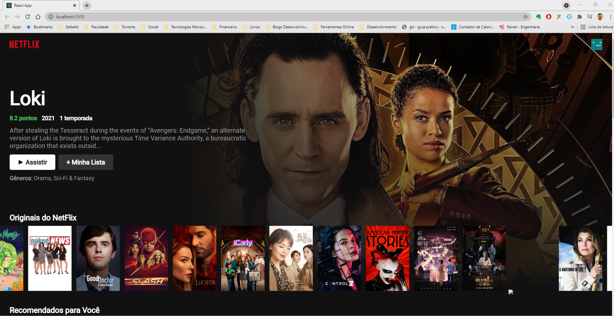
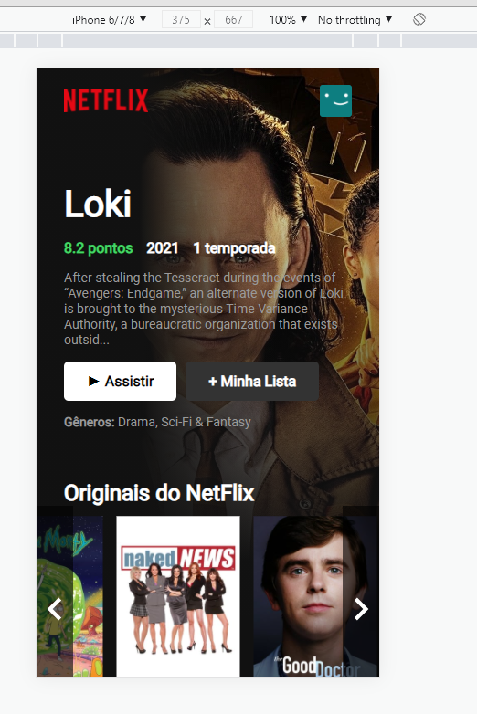

# Apresentação

Esta aplicação foi [Criado com React App](https://github.com/facebook/create-react-app).
Este App é uma reprodução da tela principal do Front-End da NetFlix.

## Recursos

* Busca das informações em uma API externa.
* Separação em categorias.
* Titulo em destaque.
* Navegção nos titulos por carrocel.
* Imagem de fundo do titulo em destaque.
* Responsivel para mobile.

### Requisitos

* Node ultima versão.
* Npm ultima versão.

#### `npm start`

Para rodar o app no modo de desenvolvimento.\
Abrir [http://localhost:3000](http://localhost:3000) no navegador.

##### `npm run build`

Para compilar o app para produção na pasta `build`.\

Acessar a seção [deployment](https://facebook.github.io/create-react-app/docs/deployment) para mais informações.
